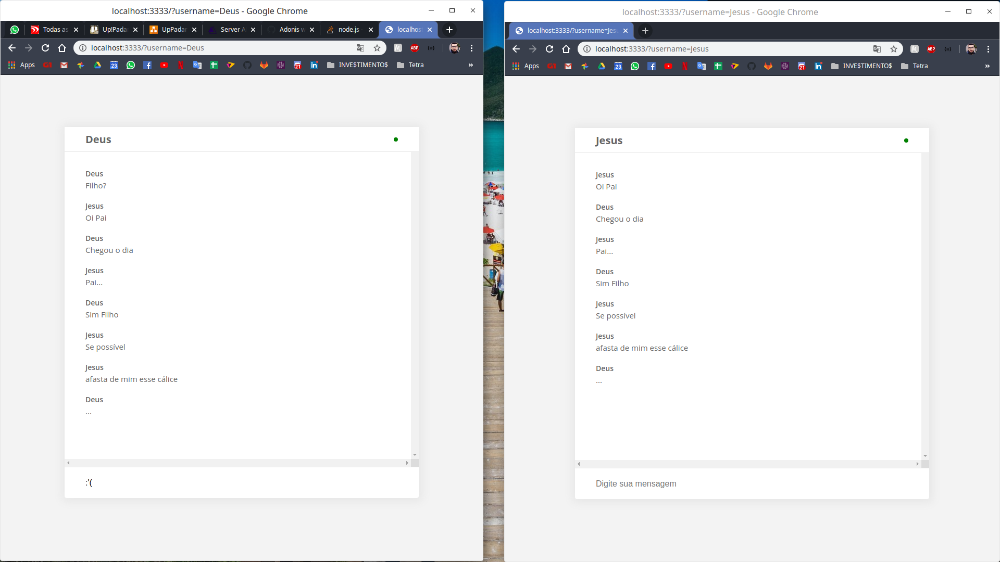

# WebSocket Adonis
Projeto simples somente para entender o funcionamento básico do web socket nativo do Adonis

# Teste
Para testar basta rodar o servidor e abrir a tela principal. Abra duas abas e use o chat com nomes diferentes.

# Chat

